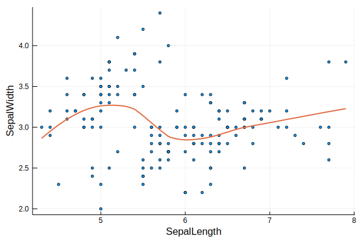

# GG.jl

[](https://mybinder.org/v2/gh/sswatson/GG.jl/master?filepath=notebooks%2FExamples.ipynb)

`GG` is a [`ggplot2`](https://ggplot2.tidyverse.org)-inspired grammar-of-graphics interface to [`Plots.jl`)](https://github.com/JuliaPlots/Plots.jl).
It is designed to allow ggplot2 examples to be translated fairly directly from R to Julia: 

```julia
using GG, RDatasets
iris = dataset("datasets", "iris")
ggplot(data = iris, 
       mapping = aes(x = :SepalLength,
                     y = :SepalWidth)) +
    geom_point(size = 2, legend = false) + 
    geom_smooth(size = 2)
```




Unprocessed keywords are passed directly to the underlying `Plots` object, so you can mix ggplot2 and Plots features.

`GG` is a work in progress. The currently supported geoms are:

```julia
geom_point
geom_jitter
geom_line
geom_path
geom_step
geom_polygon
geom_ribbon
geom_area
geom_bar
geom_hist
geom_density
geom_text
geom_smooth
```

Check out `test/runtests.jl` for examples.

## Installation

```julia
using Pkg
Pkg.add(PackageSpec(url="https://github.com/sswatson/GG.jl"))
```